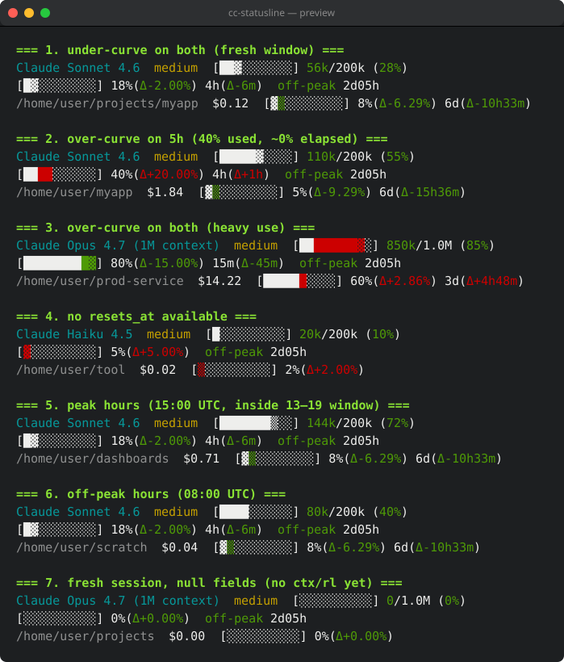

# cc-statusline



Customizable Claude Code statusline in Rust. Templating, up to 3 lines, ANSI colors, and a rate-limit bar that shows whether you're **over** or **under** the expected burn curve (red = ahead of curve, green = buffer, with Δ%, Δtime, and peak/off-peak timer).

[](LICENSE.txt)
[][code-of-conduct]

## Install

```sh
# Homebrew
brew install Team-MaRo/tap/cc-statusline
# or
brew tap Team-MaRo/tap
brew install cc-statusline

# Cargo
cargo install --git https://github.com/Team-MaRo/cc-statusline

# Nix (flake)
nix run github:Team-MaRo/cc-statusline -- --version
nix profile install github:Team-MaRo/cc-statusline
```

### Download a prebuilt binary

Asset names are **versionless**, so `releases/latest/download/<asset>` always grabs the newest build:

```sh
# Linux x86-64 (musl, static — runs on any distro)
curl -L https://github.com/Team-MaRo/cc-statusline/releases/latest/download/cc-statusline-linux-amd64-musl -o cc-statusline
chmod +x cc-statusline
```

| OS / arch | Asset |
|---|---|
| Linux x86-64 (glibc) | `cc-statusline-linux-amd64-gnu` |
| Linux arm64 (glibc) | `cc-statusline-linux-arm64-gnu` |
| Linux x86-64 (musl, static) | `cc-statusline-linux-amd64-musl` |
| Linux arm64 (musl, static) | `cc-statusline-linux-arm64-musl` |
| macOS x86-64 | `cc-statusline-darwin-amd64` |
| macOS arm64 (Apple Silicon) | `cc-statusline-darwin-arm64` |
| Windows x64 | `cc-statusline-windows-amd64-msvc.exe` |

To verify, compare against the **sha256 digest GitHub shows next to each asset** on the [releases page](https://github.com/Team-MaRo/cc-statusline/releases) (or `gh api repos/Team-MaRo/cc-statusline/releases/latest --jq '.assets[] | "\(.name) \(.digest)"'`): `shasum -a 256 cc-statusline-linux-amd64-musl`.

**macOS:** the binaries are ad-hoc signed (so they execute on Apple Silicon), but **not** notarized. A `curl`/`wget` download runs as-is; a binary downloaded via a **browser** is quarantined by Gatekeeper — clear it once with `xattr -d com.apple.quarantine ./cc-statusline` (or right-click → Open). For zero friction, install via Homebrew instead.

**macOS post-copy note:** if you manually `cp` the binary anywhere (e.g. from `target/release/` into `~/.cargo/bin/`), macOS tags the destination with `com.apple.provenance` and gatekeeper will SIGKILL the binary on every spawn — your statusline goes blank and `cc-statusline --version` exits 137. Fix with an ad-hoc re-sign:

```sh
codesign --remove-signature ~/.cargo/bin/cc-statusline 2>/dev/null
codesign -s - ~/.cargo/bin/cc-statusline
```

`cargo install` and `brew install` write directly and don't trigger this.

## Wire into Claude Code

Edit `~/.claude/settings.json`. Each positional arg = one output line (max 3). Literal `\n` inside an arg also splits. **Zero args = empty output** — you pick every token you want.

On Windows the file lives at `%USERPROFILE%\.claude\settings.json`. Windows launches the command via `cmd`, which does not honor single quotes as string delimiters — use double quotes and escape inner double quotes, or double literal percents (`%%`) if a token name clashes with an env var.

### Recommended

Three lines: model/effort/context, session/peak/weekly rate-limit curves, cwd/git/cost/tokens/speed. Dim labels, colored values, red-over / green-buffer bars with Δ%, Δtime, and peak timer.

Smart defaults (used when no `:style` is given on a token):

- `%effort` — `low/minimal/none` green, `medium` yellow, `high` red, anything else bright_red.
- `%ctx_tokens` / `%ctx_tokens_used` / `%ctx_tokens_usable` — "used" portion goes red when `exceeds_200k_tokens` is true, else green. `%ctx_tokens_max` is never auto-colored.
- `%ctx_bar` / `%ctx_bar_usable` — filled bar cells beyond the 200k mark are red, the rest stays uncolored.
- `%ctx_pct` (`%cup`) and `%ctx_pct_usable` (`%cpu`) — gradient against the auto-compact threshold (100% usable = compact): green below 70%, yellow 70–85%, bright_yellow 85–95%, red at 95%+. Ignores `exceeds_200k_tokens`. Usable budget = `context_window_size × 0.98` for models with ≥500k context (matches Claude Code's "X% context used" footer at ~98% of size); falls back to `× 0.80` for legacy 200k models. The composite `%ctx` / `%cu` displays the raw % but colors it with the same gradient, so the pct portion turns red as auto-compact nears.
- `%diff` — added count green, removed count red.

Any explicit `:style` on a token overrides these defaults.

```json
{
  "statusLine": {
    "type": "command",
    "command": "cc-statusline '%[dim Model:] %model:cyan  %[dim Effort:] %effort  %[dim Context:] %ctx_usable' '%[dim Session:] %rate5h  %peak  %[dim Weekly:] %rate7d' '%[dim cwd:] %cwd %branch:yellow %diff %[dim Cost:] %cost:green %[dim Σd:] %cost_day:green %[dim Σm:] %cost_month:green %[dim Σ:] %cost_all:green  %[dim ΣTokens:] %tokens_total:bright_cyan  %[dim Speed:] %total_speed:bright_cyan'",
    "padding": 0
  }
}
```

On Windows, swap the single quotes around each line for double quotes (escaped as `\"` inside JSON), since `cmd` launches the command and does not treat `'` as a string delimiter:

```json
{
  "statusLine": {
    "type": "command",
    "command": "cc-statusline \"%[dim Model:] %model:cyan  %[dim Effort:] %effort  %[dim Context:] %ctx_usable\" \"%[dim Session:] %rate5h  %peak  %[dim Weekly:] %rate7d\" \"%[dim cwd:] %cwd %branch:yellow %diff %[dim Cost:] %cost:green %[dim Σd:] %cost_day:green %[dim Σm:] %cost_month:green %[dim Σ:] %cost_all:green  %[dim ΣTokens:] %tokens_total:bright_cyan  %[dim Speed:] %total_speed:bright_cyan\"",
    "padding": 0
  }
}
```

### Install from the shell

Set the whole `statusLine` block (type + command + padding) in one shot. `jq` can't edit in place, hence the temp-file shuffle:

```sh
read -r -d '' CMD <<'EOF'
cc-statusline '%[dim Model:] %model:cyan  %[dim Effort:] %effort  %[dim Context:] %ctx_usable' '%[dim Session:] %rate5h  %peak  %[dim Weekly:] %rate7d' '%[dim cwd:] %cwd %branch:yellow %diff %[dim Cost:] %cost:green %[dim Σd:] %cost_day:green %[dim Σm:] %cost_month:green %[dim Σ:] %cost_all:green  %[dim ΣTokens:] %tokens_total:bright_cyan  %[dim Speed:] %total_speed:bright_cyan'
EOF

jq --arg cmd "$CMD" '.statusLine = {type: "command", command: $cmd, padding: 0}' \
  ~/.claude/settings.json > ~/.claude/settings.json.tmp \
  && mv ~/.claude/settings.json.tmp ~/.claude/settings.json
```

Overwrite only the command (keep existing type/padding):

```sh
jq --arg cmd "$CMD" '.statusLine.command = $cmd' \
  ~/.claude/settings.json > ~/.claude/settings.json.tmp \
  && mv ~/.claude/settings.json.tmp ~/.claude/settings.json
```

## Format syntax

- `%name` — render token
- `%name:style[:style...]` — apply ANSI styles (colors and/or modifiers)
- `%%` — literal `%`
- `\n` — line break inside an arg

Unknown tokens render as `%name` verbatim with a stderr warning. Tokens whose data is missing render empty; one surrounding space collapses so separators don't double.

### Styles

Colors: `black red green yellow blue magenta cyan white gray` + `bright_red … bright_white`.
Modifiers: `bold dim italic underline`.
Order-independent. Combine freely: `%m:cyan:bold`.

Honors `NO_COLOR` env and `--no-color` flag.

## Tokens

| Short | Long | Source | Output |
|---|---|---|---|
| `%m` | `%model` | `model.display_name` | `Opus 4.7 (1M context)` |
| `%mid` | `%model_id` | `model.id` | `claude-opus-4-7[1m]` |
| `%e` | `%effort` / `%thinking` | `~/.claude/settings.json` `effortLevel` | `medium` |
| `%f` | `%fast` | `fast_mode` | `fast` or empty |
| `%cu` | `%ctx` / `%context` | context vs full window | `[█▒░░░░░░░░] 156k/1M (16%)` |
| `%cuu` | `%ctx_usable` | context vs usable budget (pre-auto-compact) | `[█▒░░░░░░░░] 156k/980k (16%)` |
| `%cup` | `%ctx_pct` | | `16%` |
| `%cpu` | `%ctx_pct_usable` | % of usable budget (matches CC "X% context used") | `19.5%` |
| `%cub` | `%ctx_bar` | | `[█▒░░░░░░░░]` |
| `%cubu` | `%ctx_bar_usable` | bar vs usable budget | `[█▒░░░░░░░░]` |
| `%ct` | `%ctx_tokens` | used/full pair | `40k/1M` |
| `%ctpu` | `%ctx_tokens_usable` | used/usable pair | `40k/980k` |
| `%ctu` / `%ctm` | `%ctx_tokens_used` / `%ctx_tokens_max` | used or max alone | `156k` / `1M` |
| `%tt` | `%tokens_total` | cumulative session tokens — sum of `total_input + total_output` peaks per compaction segment; persisted in `$XDG_CACHE_HOME/cc-statusline/sessions.json`. Retained forever unless `--prune` (or `CC_STATUSLINE_STATE_TTL_SECONDS`) is set. | `4.8M` |
| `%rl5` | `%rate5h` | 5-hour rate limit | `rl5h:▕bar▏N%(Δ%) 3h27m(Δ±t)` |
| `%rl5p` / `rl5b` / `rl5r` / `rl5d` | `rate5h_pct` / `_bar` / `_reset` / `_delta` | | parts of the above |
| `%rl7` | `%rate7d` | 7-day rate limit | same shape |
| `%rl7p` / `rl7b` / `rl7r` / `rl7d` | same suffixes | | |
| `%pk` | `%peak` | current time | `peak 3h27m` (red) / `off-peak 5h12m` (green); window 5–11 AM US/Pacific Mon–Fri (DST-aware) |
| `%b` | `%branch` | `git rev-parse` in `cwd` | `⎇ main` |
| `%bn` | `%branch_name` | | `main` |
| `%d` | `%diff` | `git diff --numstat HEAD` | `(+12,-3)` |
| `%cwd` | `%cwd` | `cwd`, tilde-abbreviated | `~/Projects/foo` |
| `%cwdb` | `%cwd_base` | | `foo` |
| `%c` | `%cost` | this chat's cumulative cost — persisted, so it survives Claude resetting `total_cost_usd` mid-chat (sum of cost-segment peaks, never goes backwards) | `$0.35` |
| `%cd` | `%cost_day` | today's cost — summed across every chat's per-day ledger | `$48.10` |
| `%cm` | `%cost_month` | current local calendar month's cost — summed across every chat's per-day ledger | `$310.20` |
| `%ca` | `%cost_all` | all-time cost — summed across every chat's per-day ledger (a chat's history is dropped if its session is `--prune`d) | `$2014.50` |
| `%la` / `%lr` | `%lines_added` / `%lines_removed` | | `+42` / `-7` |
| `%dur` / `%apidur` | `%duration` / `%api_duration` | | `14m12s` |
| `%os` | `%output_style` | | `default` |
| `%v` | `%version` | Claude Code version | `2.1.118` |
| `%sid` | `%session_id` | first 8 chars | `d6486277` |
| `%vim` | `%vim` | `$CC_VIM_MODE` env | `NORMAL` (if set) |

## Rate-limit bar semantics

Each rate-limit window has two curves:

- **Used %** — what you've consumed.
- **Expected %** — linear time elapsed through the window (0 at reset−window, 100 at reset).

Each cell of the bar fills progressively as `░` → `▒` → `▓` → `█` (3 sub-levels per cell, 30 sub-units across 10 cells). Used drives the glyph; cells the used hasn't reached but expected has are shown as a green ghost at the matching sub-level. When used > expected, the over-portion is red. `Δ%` is signed percentage-point difference; `Δt` compares actual remaining time to the time you'd have left if you were exactly on the expected curve. During the peak window (5–11 AM US/Pacific Mon–Fri, DST-aware) the timer is colored red.

## Flags

- `--no-color` / `NO_COLOR=1`
- `--now <unix>` / `NOW=<unix>` (for testing)
- `--prune <DUR>` drop persisted sessions older than `DUR` (`30d`, `12h`, `4w`, or bare seconds; current session always kept). Off by default — state is retained forever unless set. Mirrors `CC_STATUSLINE_STATE_TTL_SECONDS`.
- `--debug` dump stdin JSON to stderr
- `--passthrough` write stdin JSON unchanged to stdout while still updating the MCP state file — chain another statusline tool downstream (see [Using a different statusline renderer](#using-a-different-statusline-renderer))
- `-V` / `--version`, `-h` / `--help`

## Environment variables

| Variable | Default | Effect |
|---|---|---|
| `NO_COLOR` | unset | Any value disables all ANSI styling (mirrors `--no-color`). Standard cross-tool convention. |
| `NOW` | unset | Override "current time" as a unix timestamp. Used for deterministic peak-hour / rate-limit math in tests; mirrors `--now`. |
| `CC_VIM_MODE` | unset | Value rendered by the `%vim` token (e.g. `NORMAL`, `INSERT`). Typically set by a vim-mode integration. |
| `CLAUDE_CONFIG_DIR` | `~/.claude` | Where to read `settings.json` from (for `%effort` / `effortLevel`). |
| `XDG_CACHE_HOME` | `~/.cache` | Base directory for `cc-statusline/sessions.json` (the `%tokens_total` state file). |
| `CC_STATUSLINE_STATE_TTL_SECONDS` | _unset_ (no pruning) | Opt-in retention: when set (seconds), session entries older than this are pruned on each invocation (current session always kept). Equivalent to the `--prune` flag, which takes precedence. Each session carries its own cost ledger, so pruning a session also drops its contribution to the day/month/all-time totals. |

## MCP server

`cc-statusline mcp` runs a stdio MCP server that exposes the persisted statusline state to any MCP client — letting Claude (or another assistant) ask for its own context usage / rate-limit headroom mid-conversation. The server is read-only and uses the same `~/.cache/cc-statusline/sessions.json` file the statusline writes; no live stdin needed.

Register with Claude Code:

```sh
claude mcp add cc-statusline -s user cc-statusline mcp
```

Tools:

| Tool | Args | Returns |
|---|---|---|
| `context_usage` | `session_id?` (defaults to most-recently-updated) | session's segment list + current peak + total + `context_window_size` + `used_percent` + `usable_percent` + `remaining_usable_tokens` |
| `rate_limits` | — | latest 5-hour and 7-day rate-limit snapshot + `remaining_seconds` until reset + `snapshot_age_seconds` |
| `session_summary` | `session_id?` | merge of both |

Manual smoke:

```sh
printf '%s\n' \
  '{"jsonrpc":"2.0","id":1,"method":"initialize","params":{"protocolVersion":"2024-11-05","capabilities":{}}}' \
  '{"jsonrpc":"2.0","id":2,"method":"tools/call","params":{"name":"session_summary","arguments":{}}}' \
  | cc-statusline mcp
```

The state file is populated by your regular statusline renders — the first time you load this you'll see entries for every active session.

### Using a different statusline renderer

If you prefer another statusline tool but still want the MCP server's `context_usage` / `rate_limits` / `session_summary` data, chain `cc-statusline --passthrough` in front of it:

```jsonc
// ~/.claude/settings.json
{
  "statusLine": {
    "type": "command",
    "command": "cc-statusline --passthrough | other-statusline-tool"
  }
}
```

`--passthrough` reads Claude Code's JSON from stdin, updates `~/.cache/cc-statusline/sessions.json` (so the MCP server has fresh data), then writes the JSON unchanged to stdout for the downstream tool to render. Any positional format args are ignored in this mode.

## Development

```sh
cargo test
cargo build --release
echo '<stdin json>' | ./target/release/cc-statusline '%m %cu'
```

Regenerate the preview SVG after changing rendering:

```sh
cargo build --release --bin cc-statusline
cargo run --release --example gen_svg
```

### Build & install from source

Installs the release binary to `~/.cargo/bin/cc-statusline` (make sure that's on your `$PATH`):

```sh
cargo install --path . --force
cc-statusline -V
```

Install straight from the repo without cloning:

```sh
cargo install --git https://github.com/Team-MaRo/cc-statusline
```

Run the full pre-commit check (fmt + clippy-as-error + tests) before pushing:

```sh
cargo fmt --check && cargo clippy --all-targets --all-features -- -D warnings && cargo test
```

Clippy lints move between Rust releases. If rust-analyzer flags something the CLI misses, update the toolchain: `rustup update stable`.

### Windows build notes

Build with the default `x86_64-pc-windows-msvc` toolchain. It needs the Visual Studio Build Tools (MSVC linker + Windows SDK) — install them once with:

```sh
winget install --id Microsoft.VisualStudio.2022.BuildTools -e \
  --override "--quiet --wait --norestart --add Microsoft.VisualStudio.Workload.VCTools --includeRecommended"
```

Then build from a shell where MSVC `cl`/`link` are on `PATH`. A plain prompt won't have them — source `vcvars64.bat` first (or use the "Developer Command Prompt for VS"):

```powershell
cmd /c '"C:\Program Files (x86)\Microsoft Visual Studio\2022\BuildTools\VC\Auxiliary\Build\vcvars64.bat" && cargo install --path . --force'
```

> The GNU toolchain (`stable-x86_64-pc-windows-gnu`) is **not** supported: a transitive dependency (`chrono`/`windows-link`) makes it invoke `dlltool`, which needs an assembler (`as.exe`) that rustup's bundled MinGW doesn't ship.

If linking fails with `link: extra operand ...`, Git Bash's `/usr/bin/link.exe` (coreutils) is shadowing MSVC's `link.exe` — build from PowerShell or a Developer Command Prompt instead.

## Contributing

Please read [CONTRIBUTING.md][contributing] for details on our code of conduct and the process for submitting pull requests.

This project uses [Conventional Commits](https://www.conventionalcommits.org/) for automated releases and changelog generation.

## Versioning

We use [SemVer](http://semver.org/) for versioning. For available versions, see the [tags on this repository][gh-tags].

## Authors

### Special thanks for all the people who had helped this project so far

- **Manuele** - [D3strukt0r](https://github.com/D3strukt0r)
- **Oliver** - [Oliver-Zieschang](https://github.com/Oliver-Zieschang)

See also the full list of [contributors][gh-contributors] who participated in this project.

### I would like to join this list. How can I help the project?

We're currently looking for contributions for the following:

- [ ] Bug fixes
- [ ] Translations
- [ ] etc...

For more information, please refer to our [CONTRIBUTING.md][contributing] guide.

## License

This project is licensed under the MIT License - see the [LICENSE.txt](LICENSE.txt) file for details.

## Acknowledgments

This project currently uses no third-party libraries or copied code.

[gh-tags]: https://github.com/Team-MaRo/cc-statusline/tags
[gh-contributors]: https://github.com/Team-MaRo/cc-statusline/contributors
[contributing]: https://github.com/Team-MaRo/.github/blob/master/CONTRIBUTING.md
[code-of-conduct]: https://github.com/Team-MaRo/.github/blob/master/CODE_OF_CONDUCT.md
